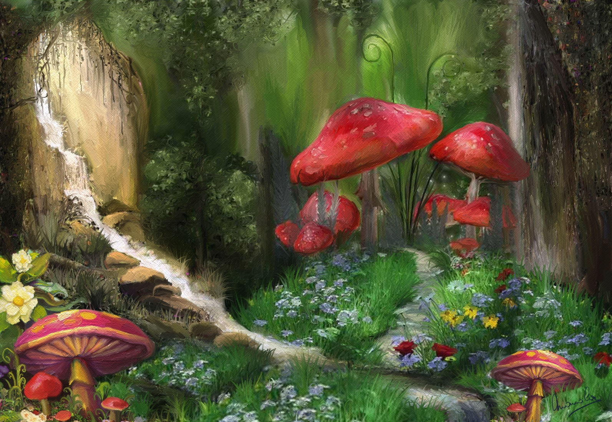

# L'HISTOIRE DES GOBOMELFES

Sa couleur de peau orangée venait de la contenue en Fer de l'eau du puits. C'ètait aussi, une
marque *d'origine*, de *pureté de souche*. Hélas, cette condition les metait aussi en grand danger 
face aux chasseurs. Les survivants ont commencé à chercher des facons de maintenir le status mais en 
changeant sa pigmentation. 

